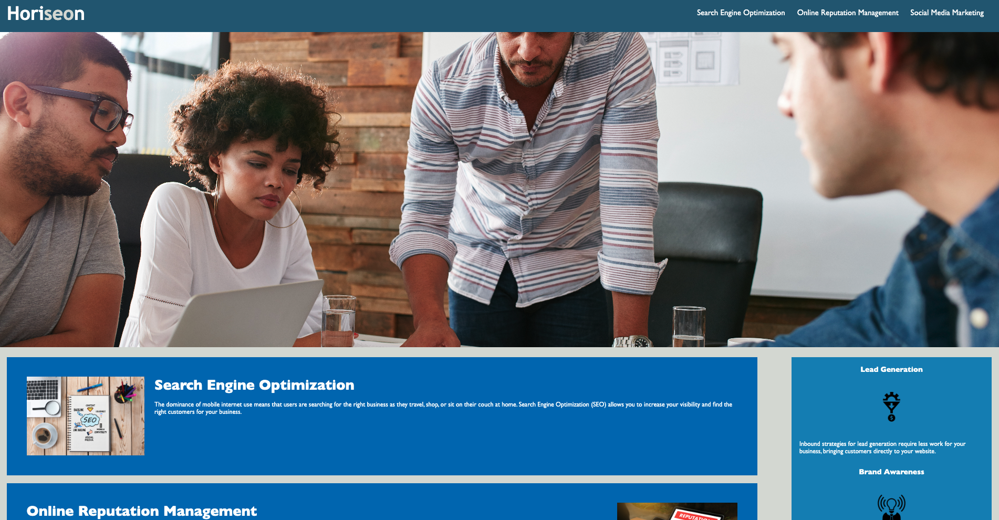

# Challenge 01

## Description

To increase the pace of customers finding the things they need as easy as a button from wherever they are.

- Making a search engine that is quick and fast to locate whatever it is that you need.

- Built the website to show the dominanace of resources while searching for the things that you need, and why social media marketing is a big resource.

-Solves the issue of doing less work but a more efficient way of finding customers to see your website.

## Usage

[Github Page Adress](https://github.com/RehanJet/challenge-module-01) 

### Screenshot



    ```md
     
    ```